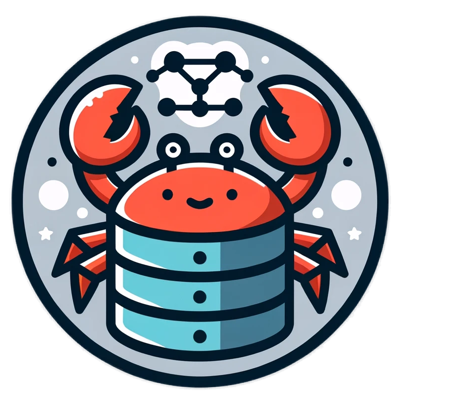

<div>
  
  <h1>OKV: Okay Key-Value Storage</h1>
</div>
 
[](https://docs.rs/okv) [](https://crates.io/crates/okv) [](./LICENSE-APACHE)

> [!WARNING]  
> The `main` branch contains the latest development changes and is not available for use.

OKV has provides a single, unified API for working with key-value storage, regardless of the underlying database. You get the flexibility to support multiple databases and serialization formats without changing your code, and no more fighting with async/await, lifetimes, or complex database APIs. Serialization is handled automatically, with whatever format you choose, with JSON and MessagePack supported out of the box and great serde support.

## Features

- **Multiple Database Backends**:
  - `memdb`: Pretty much just a HashMap that supports multithreading, for testing and prototyping
  - `rocksdb`: RocksDB integration for robust, disk-based storage
  - `redb`: Pure Rust embedded database inspired by lmdb
  - `cloudflare`: Cloudflare KV and D1 storage for serverless applications, from workers or using the http API
    <!-- - `sqlite`: SQLite support for relational data storage. -->
- **Serialization Formats**:
  - `serde_json`: JSON serialization for human-readable data storage
  - `rmp-serde`: MessagePack serialization for efficient binary data storage
  - _or bring your own format_
- **Robust API**:
  - **helpers** for common operations
  - **transactions** for consistency (cross-database transactions are not supported yet)
  - **iterators** for efficient data access
  - **sync** and **async** APIs
  - **direct access** to the underlying database for advanced use cases

## Installation

Add OKV to your project:

```bash
cargo add okv
```

# Quick Start

```rust
use okv::{Env};
use okv::backend::memory::MemDB;

fn main() -> eyre::Result<()> {
    // initialize the storage backend
    let memdb = MemDB::new();
    let env = Env::new(memdb);

    // open a database with the specified key and value types
    let db = env.open::<&str, &str>("my_database")?;

    // Working with data
    db.set_nx("key", "val")?;
    assert_eq!(db.get("key")?, Some("val".to_string()));

    Ok(())
}
```

# Supported Types

OKV can work with any type that implements `serde::Serialize`/`serde::Deserialize`. Additionally, it supports the following types out of the box without any serialization overhead:

- Integer types: [`u8`], [`u16`], [`u32`], [`u64`], [`u128`], [`i8`], [`i16`], [`i32`], [`i64`], [`i128`]
- Basic types: `()`, [`&str`], [`String`], [`bool`]
- Binary data: any type that implements `AsRef<[u8]>` like [`Vec<u8>`], [`&[u8]`]

If you want to update a type later, I recommend [obake](https://crates.io/crates/obake) that adds versioning and migration support on a per key basis and works well with OKV.

# Versioning

OKV follows [Semantic Versioning](https://semver.org/), but only changes to the user-facing API are considered breaking changes. `okv_core` can have breaking changes in minor versions, so when using the backends directly, their version should match the version of `okv`.

# License

Licensed under either of [Apache License, Version 2.0](./LICENSE-APACHE) or [MIT license](./LICENSE-MIT) at your option.

Unless you explicitly state otherwise, any contribution intentionally submitted for inclusion in OKV by you, as defined in the Apache-2.0 license, shall be dual licensed as above, without any additional terms or conditions.
